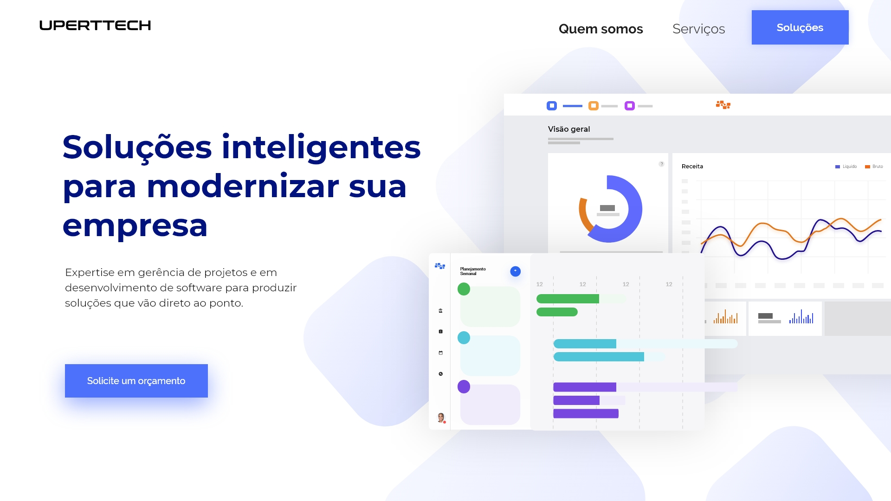

# Design da página principal

Você pode escolher uma das três alternativas para implementar no seu projeto. As imagens necessárias para implementá-las já estão na pasta `public` (nos arquivos com as respectivas numerações: _art1.svg, art3.svg, background1.svg_, etc.)

Nelas, o botão `Soluções` deverá direcionar o usuário para a página de exibição dos produtos, e o botão `Solicitar orçamento` deverá direciona-lo para a página de cadastro.

A fonte utilizada é a [Montserrat](https://fonts.google.com/specimen/Montserrat).

